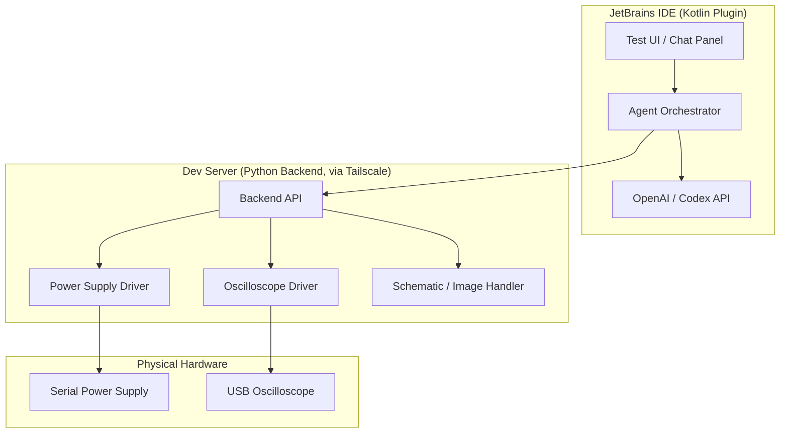
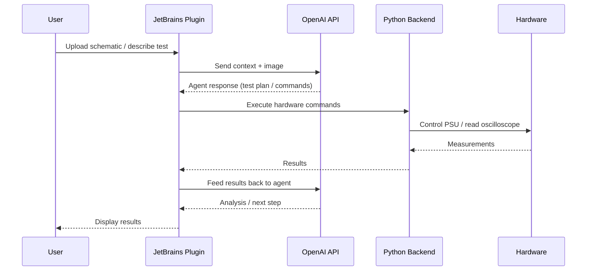

# CLAUDE.md

This file provides guidance to Claude Code (claude.ai/code) when working with code in this repository.

## Project Overview

Agentic hardware testbench with a JetBrains IDE plugin frontend. The system lets users drive hardware tests through an IDE, with an AI agent (OpenAI/Codex) interpreting schematics, images, and test results. Hardware control (power supply, oscilloscope) runs on a local Python backend; the IDE plugin communicates with that backend and with the OpenAI API.

**Monorepo layout:**
- Python — hardware control, instrument drivers, agent orchestration backend
- Kotlin — JetBrains IDE plugin, OpenAI API integration, UI

## Architecture

The plugin owns the AI conversation and sends structured commands to the Python backend, which executes them against real hardware. There is no hardware mocking — all testing requires physical instruments connected to the dev server.

### Test Session Data Flow

## Dev Environment

Development happens on a remote server accessed via **Tailscale + SSH tunnel**. When running or testing anything, assume the developer is already SSH'd into the server — do not suggest local execution or browser-based UIs that require a local display. Prefer CLI output and terminal-friendly workflows.

## Git Workflow

- **Feature branches** off `main`: `feat/<short-description>`, `fix/<short-description>`
- PRs merged into `main` following standard review practices
- Commit messages: imperative mood, concise subject line

## Python Side

- Hardware interfaces are real — no simulators or mocks
- Instrument drivers (power supply, oscilloscope) should be kept modular and swappable
- Agent orchestration flow is user-defined per test session; don't hardcode sequences

## Kotlin / JetBrains Plugin

- Plugin communicates with the local Python backend (not cloud) for all hardware operations
- OpenAI/Codex API calls originate from the plugin side
- Keep IDE plugin logic decoupled from specific hardware details — hardware knowledge lives in Python
