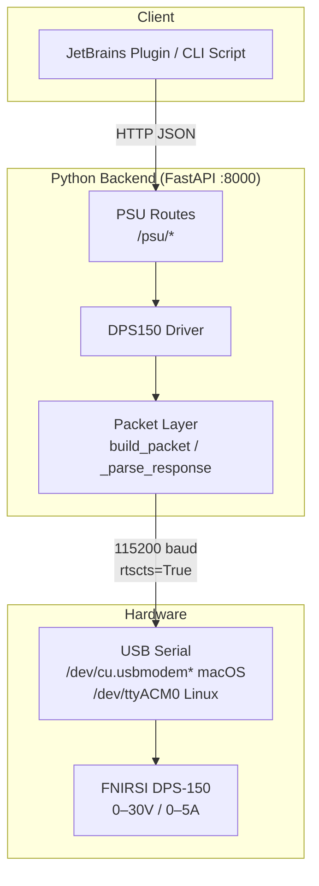
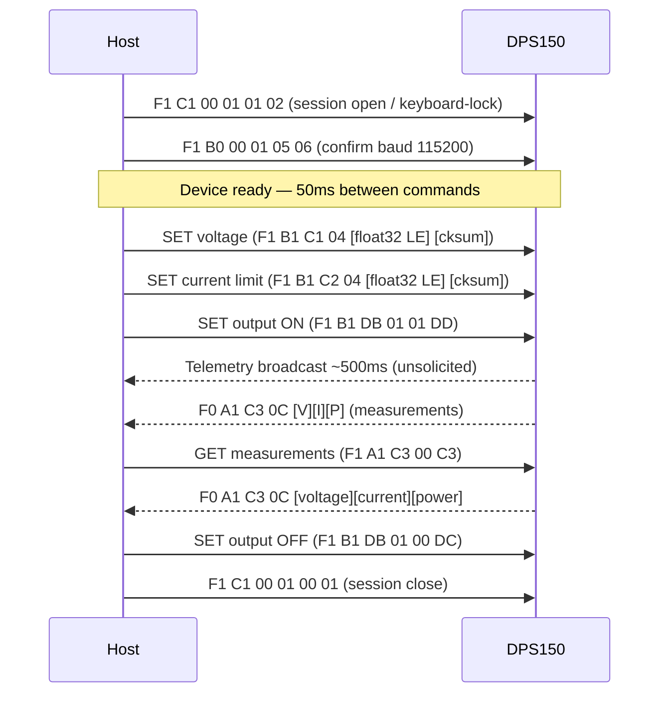
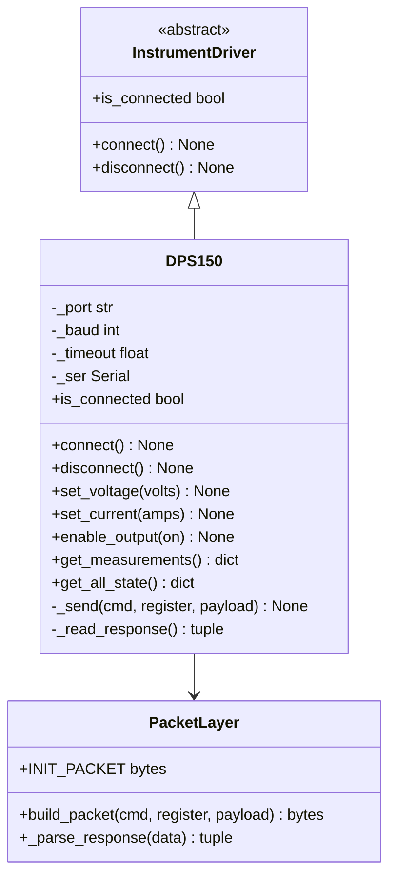
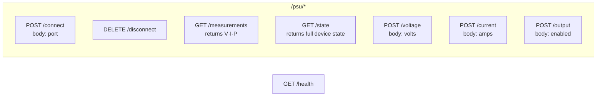
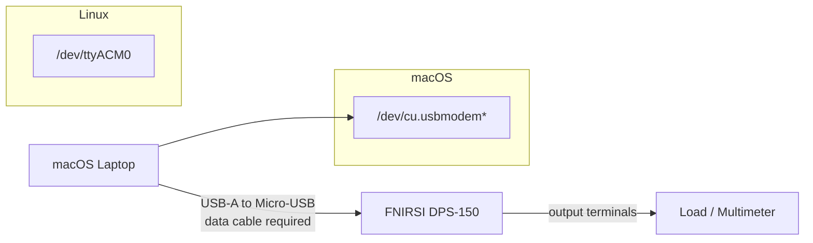
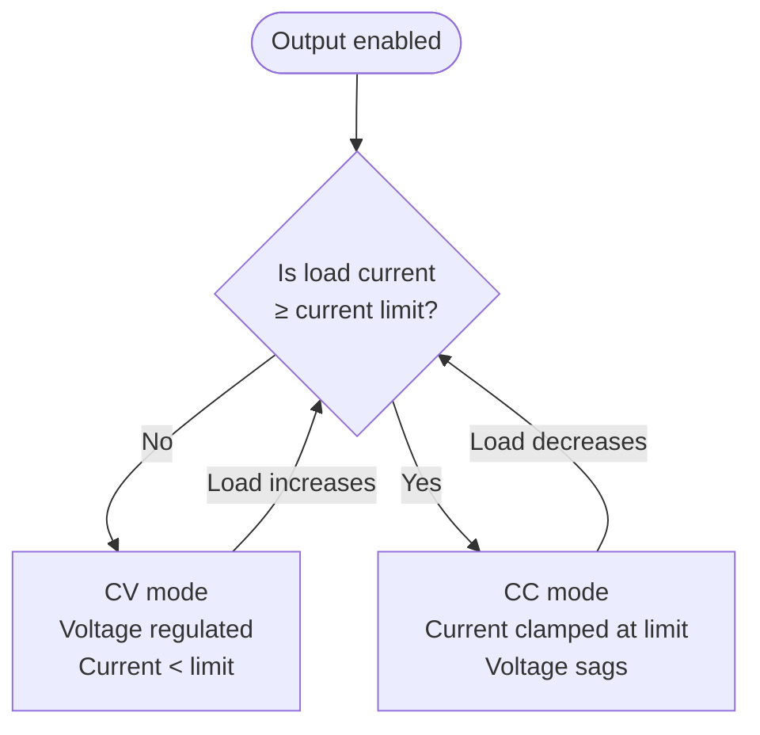

# DPS-150 Power Supply Backend

Python FastAPI backend for controlling the FNIRSI DPS-150 DC power supply over USB serial.

---

## System Architecture



---

## Serial Protocol



### Frame Format

```
[0xF1] [cmd] [register] [len] [payload…] [checksum]
  │      │       │         │       │           │
  │      │       │         │       │           └─ (register + len + sum(payload)) % 256
  │      │       │         │       └─ data bytes (floats = IEEE-754 LE 32-bit)
  │      │       │         └─ payload length
  │      │       └─ register address
  │      └─ 0xB1 SET | 0xA1 GET
  └─ 0xF1 host→device | 0xF0 device→host
```

### Key Registers

| Register | Hex | Direction | Type | Description |
|---|---|---|---|---|
| VOLTAGE_SET | 0xC1 | SET | float32 | Output voltage setpoint (V) |
| CURRENT_SET | 0xC2 | SET | float32 | Current limit (A) |
| OUTPUT_ENABLE | 0xDB | SET | uint8 | 0=off, 1=on |
| MEASUREMENTS | 0xC3 | GET | 3×float32 | Output V, I, P |
| INPUT_VOLTAGE | 0xC0 | GET | float32 | USB input voltage |
| TEMPERATURE | 0xC4 | GET | float32 | Internal temperature |
| ALL_STATE | 0xFF | GET | 139 bytes | Full device state dump |

---

## Driver Architecture



---

## API Endpoints



### Request / Response Examples

**Connect**
```json
POST /psu/connect
{"port": "/dev/cu.usbmodem1480DFDC40251"}
→ {"status": "connected", "port": "/dev/cu.usbmodem1480DFDC40251"}
```

**Set voltage**
```json
POST /psu/voltage
{"volts": 5.0}
→ {"status": "ok", "voltage_set": 5.0}
```

**Set current limit**
```json
POST /psu/current
{"amps": 0.2}
→ {"status": "ok", "current_set": 0.2}
```

**Enable output**
```json
POST /psu/output
{"enabled": true}
→ {"status": "ok", "output_enabled": true}
```

**Read measurements**
```json
GET /psu/measurements
→ {"voltage": 4.982, "current": 0.1523, "power": 0.7591}
```

**Full state**
```json
GET /psu/state
→ {
    "input_voltage": 12.1,
    "voltage_set": 5.0,
    "current_set": 0.2,
    "voltage": 4.982,
    "current": 0.1523,
    "power": 0.7591,
    "temperature": 31.4,
    "output_enabled": true,
    "protection": 0,
    "mode": "CV",
    "voltage_max": 30.0,
    "current_max": 5.0
  }
```

**Error — not connected**
```json
→ 503 {"detail": "PSU not connected"}
```

**Error — serial port unavailable**
```json
→ 503 {"detail": "Cannot open port /dev/cu.usbmodem...: [Errno 16] Resource busy"}
```

---

## Hardware Setup



**macOS notes:**
- Port appears as `/dev/cu.usbmodem*` (use `cu.` not `tty.` variant)
- Requires a data cable — charge-only cables carry no serial data
- Hardware flow control (`rtscts=True`) is required — device won't respond without it
- No additional driver needed (AT32 VCP enumerates natively on macOS)

**Linux notes:**
- Port appears as `/dev/ttyACM0`
- Add user to `dialout` group if permission denied: `sudo usermod -aG dialout $USER`

---

## Running

```bash
cd backend

# Install dependencies
pip install -r requirements.txt

# Start backend (default port 8000)
python main.py

# Override serial port via env var
PSU_PORT=/dev/cu.usbmodem1480DFDC40251 python main.py
```

**Environment variables:**

| Variable | Default | Description |
|---|---|---|
| `PSU_BAUD` | `115200` | Serial baud rate |
| `PSU_TIMEOUT` | `0.5` | Serial read timeout (seconds) |

---

## Testing

```bash
cd backend

# Unit + API tests (no hardware required)
python -m pytest tests/ -v

# Hardware validation — set 5V / 200mA, read measurements
python set_voltage.py /dev/cu.usbmodem1480DFDC40251 5.0 0.2

# Hardware validation — with known load resistance
# Script calculates expected current and operating mode (CC vs CV)
python set_voltage.py /dev/cu.usbmodem1480DFDC40251 5.0 0.2 33
```

---

## CC vs CV Mode



- **CV (Constant Voltage):** normal operation — voltage held at setpoint, current free to vary below limit
- **CC (Constant Current):** overload — current clamped at limit, voltage drops. Triggered by short circuit or low-resistance load.

---

## Known Quirks

- **`rtscts=True` required** — hardware flow control must be enabled or the device ignores all commands
- **50ms between commands** — device needs inter-command delay; sending too fast drops commands silently
- **SET commands are fire-and-forget** — no ACK from device; verify via GET or telemetry
- **Session open required first** — sending the INIT_PACKET (`F1 C1 00 01 01 02`) before any other command is mandatory; device ignores commands without it
- **Use `cu.` not `tty.` on macOS** — `tty.*` devices block on open until a carrier is detected; `cu.*` opens immediately
